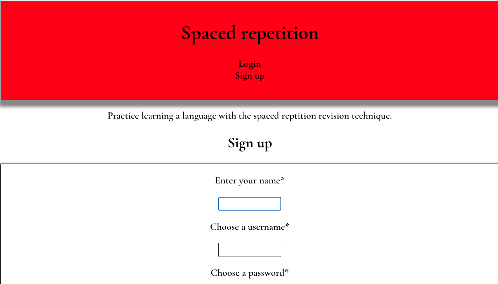
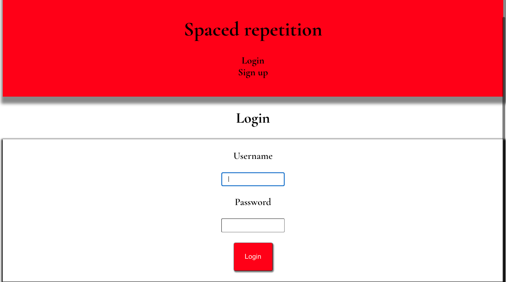
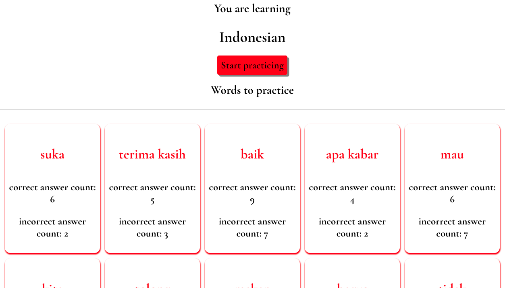
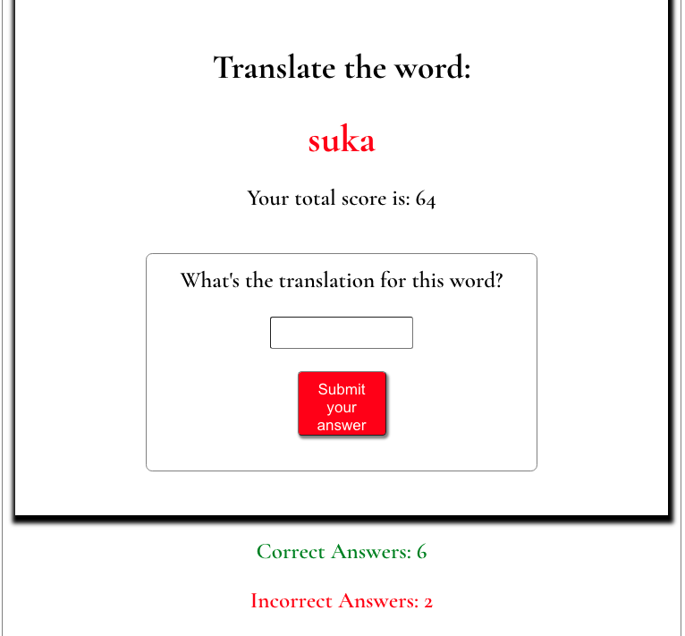
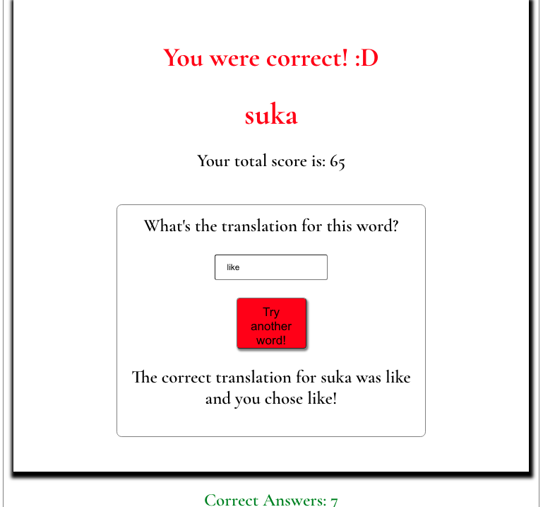

# Spaced Repetition Capstone

- [Live_App](https://spaced-repetition-one.vercel.app/)
- [Server_Side_Repo](https://github.com/eriyanto87/spaced-repetition-api)
- [Client_Side_Repo](https://github.com/eriyanto87/spaced-repetition-client)

## Description

An app which uses spaced repetition to help people memorize a foreign language. The app display words in one language and the users will be asked to input the corresponding word in a second language.

## Screenshots

### Front-end technologies

Reactjs, HTML, CSS, JavaScript, HTML

### Back-end technologies

Node.js, Express

### Database

PostgreSQL

### Tested with

Cypress and Mocha

## Hosted on

Heroku and Vercel
